# ESTsoft 오르미 6기 Front-end Project

## 저자 (Author)

**장윤종**

## 구현 기능

[피그마 링크](<https://www.figma.com/design/s9RCnA6dSi3QHHeMDFHKE6/EST-%EC%98%A4%EB%A5%B4%EB%AF%B8(BE)_HTML%2FCSS%2FJS?node-id=104924-12&t=DkHqKMa1PBxYw4n3-0>)

- 피그마 렌딩페이지를 기반으로 웹 페이지 구현
- HTML / CSS / JavaScript
- VS Code
- PC Version
- 스크롤 업 버튼 구현
- 이메일 주소 유효성 검사 후 modal 팝업 창 구현

[배포된 웹 페이지](https://yoonjong-j.github.io/ESTsoft-FE-Project/)

## Layout

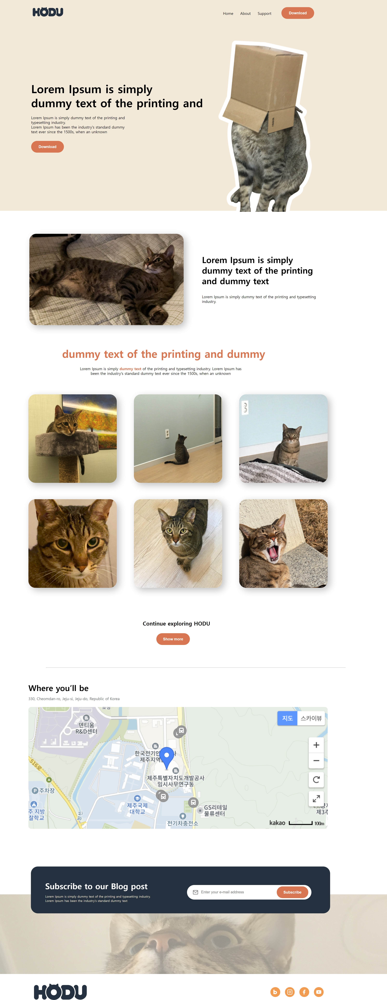

```HTML
<!DOCTYPE html>
<html lang="en">
  <head>
    <meta charset="UTF-8" />
    <meta name="viewport" content="width=device-width, initial-scale=1.0" />
    <title>Document</title>
  </head>
  <body>
    <header>
      <nav></nav>
    </header>
    <main>
      <article></article>
    </main>
    <footer>
      <div></div>
    </footer>
  </body>
</html>
```

### header

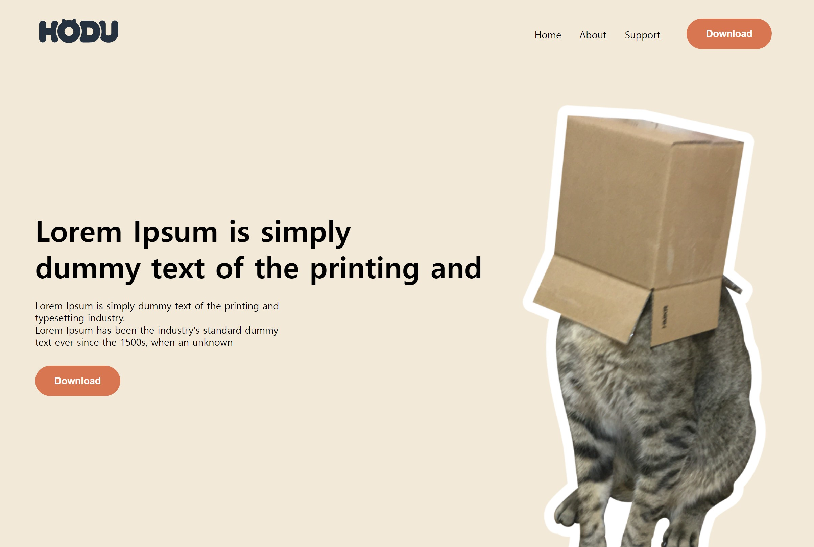

### main

#### Article 1

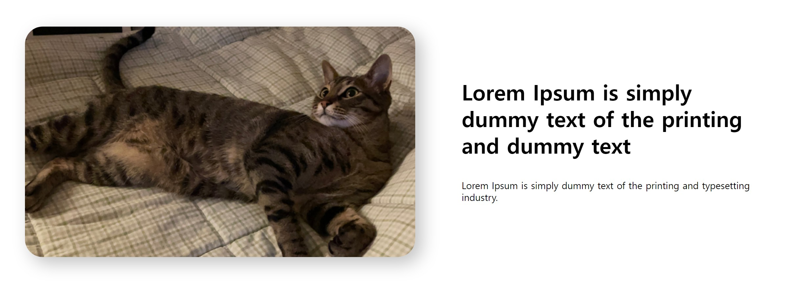
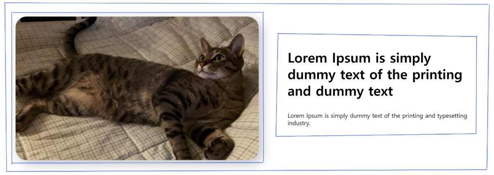

```HTML
<!DOCTYPE html>
<html lang="en">
  <head>
    <meta charset="UTF-8" />
    <meta name="viewport" content="width=device-width, initial-scale=1.0" />
    <title>Document</title>
  </head>
  <body>
    <div class="container">
      <div></div>
      <div></div>
    </div>
  </body>
</html>
```

```CSS
.container {
  display: flex;
}
```

#### Article 2

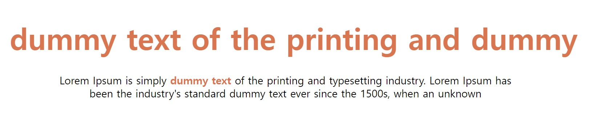

#### Article 3

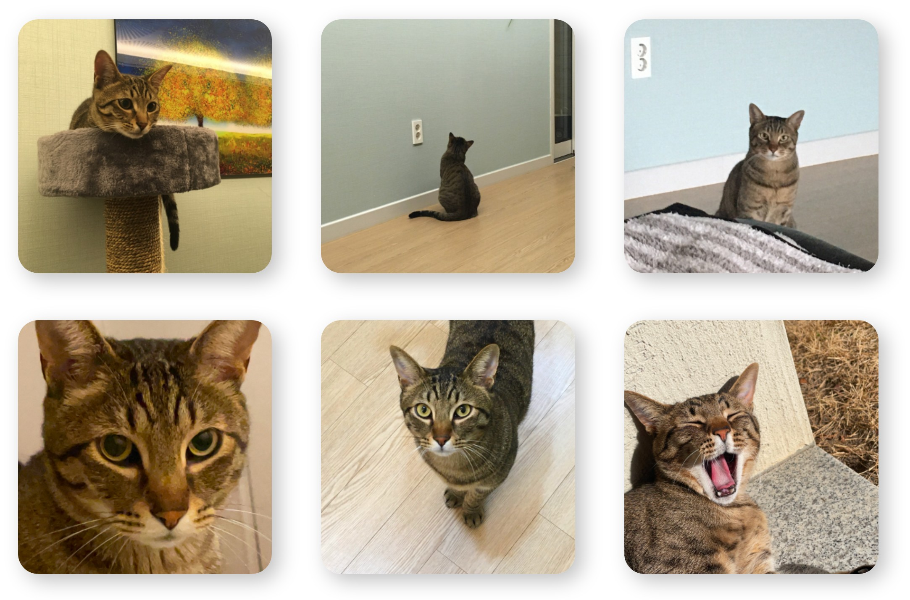

#### Article 4

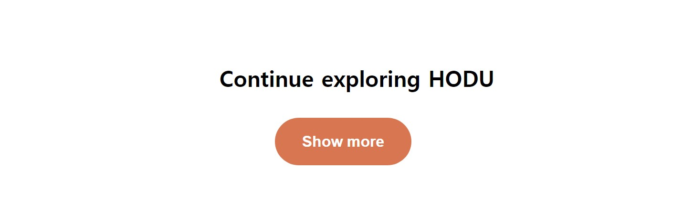

#### Article 5


- hr 태그

#### Article 6

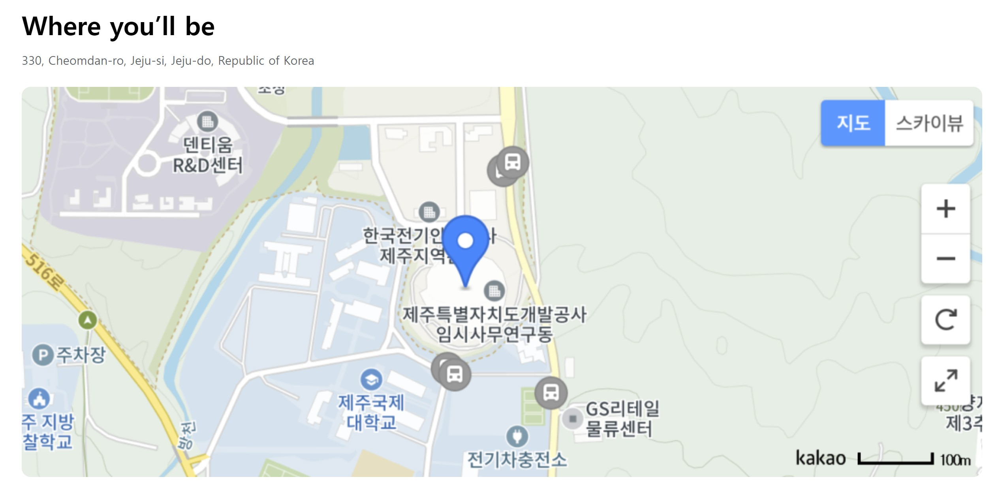

#### Article 7

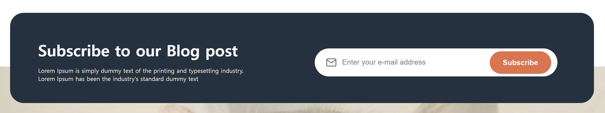

#### Article 8

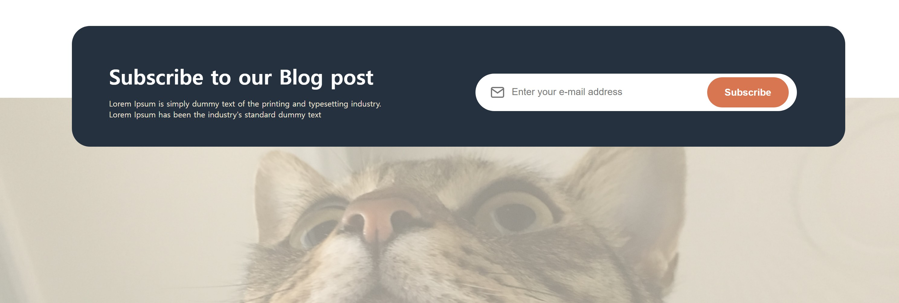

```CSS
main::after {
  background-image: url(./image.png);
  z-index: -1;
}
```

### footer


## JavaScript 기능 구현

### 이메일 주소 유효성 검사

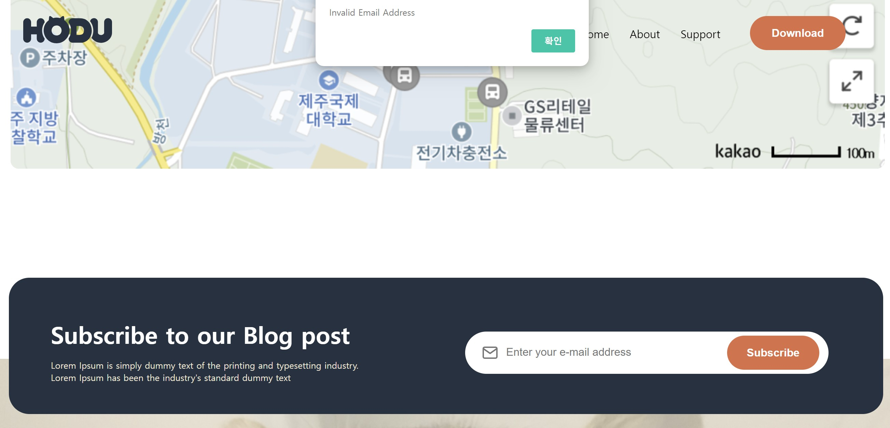

- 입력된 값이 없거나, 혹은 잘못된 이메일 주소가 입력되었으면 윈도우 알림창이 뜸

### modal 팝업 창

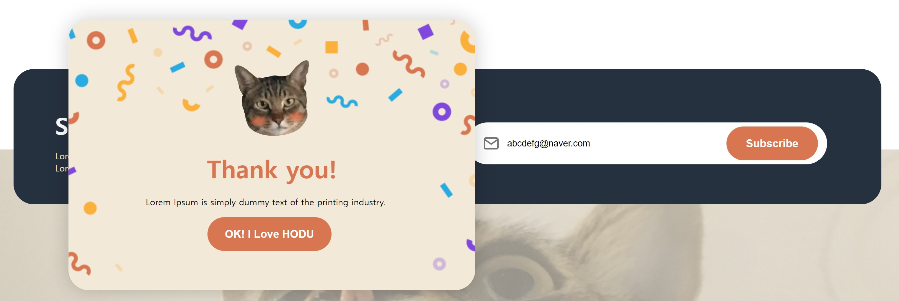

- 유효한 이메일 주소를 입력하고 'Subscribe' 버튼을 클릭하면 modal 팝업 창이 뜸
- modal 팝업 창의 'OK! I Love HODU' 버튼을 클릭하면 modal 팝업 창 닫힘

### 스크롤 업 버튼

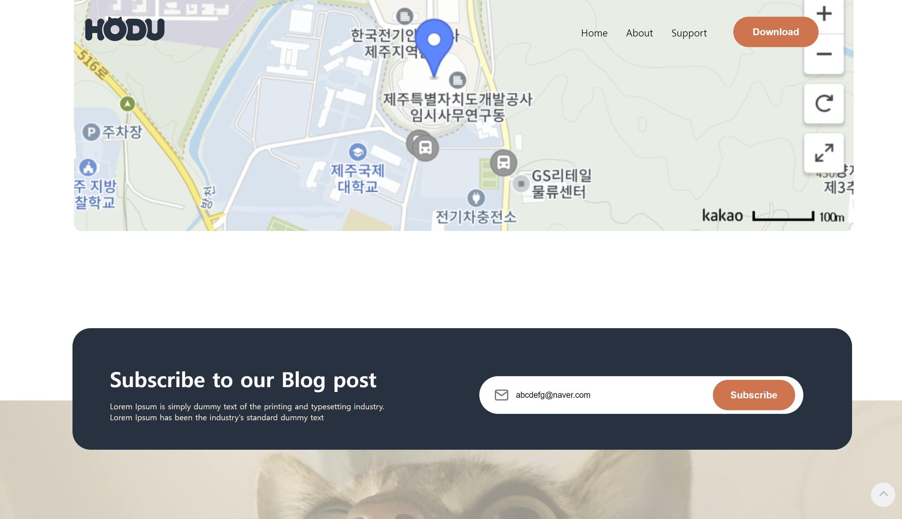

- 스크롤 시 스크롤 업 버튼 생성
- 클릭 시 웹 페이지 최상단으로 이동

## 코드 작성하면서 겪었던 오류

### 오류 (Error)

```
TypeError: subsBtn.addEventListener is not a function
```

```JavaScript
const subsBtn = document.getElementsByClassName("subscribe-btn");
subsBtn.addEventListener("click", () => {});
```

- 위와 같이 **addEventListener**가 작동하지 않음

### 해결 (Solution)

```JavaScript
const subsBtn = document.getElementsByClassName("subscribe-btn");
subsBtn[0].addEventListener("click", () => {});
```

- **document.getElementsByClassName**은 동일한 클래스명을 가진 모든 HTML 요소를 배열의 형태로 저장해서 반환

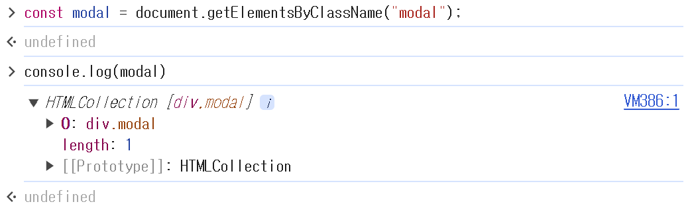
